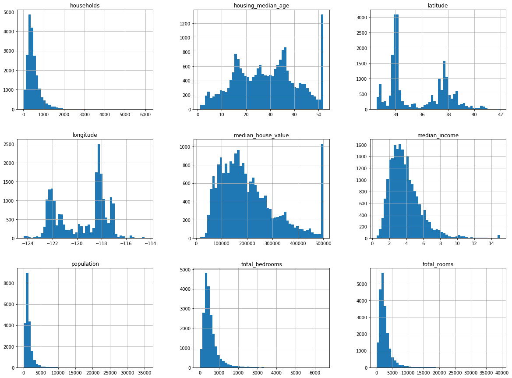
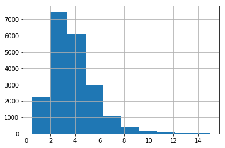
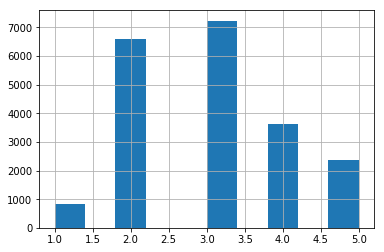
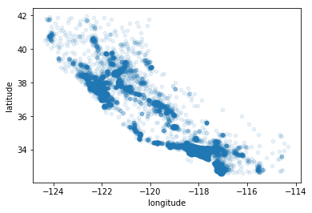
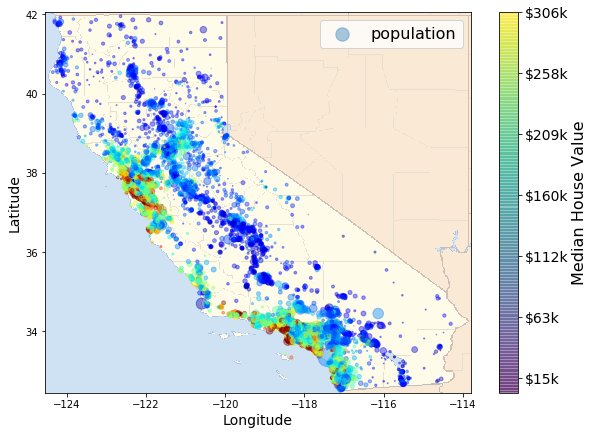
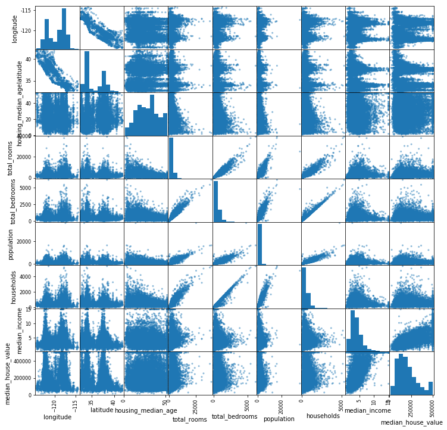
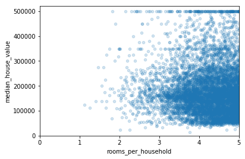
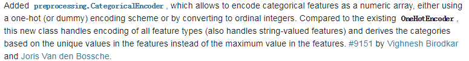

# End-to-End Machine Learning Project

前端时间在玩Kaggle，现在看到[这本书](https://item.jd.com/12241590.html)，写的真的很实用，在这就分享下如何玩转机器学习项目。

## Get the Data

在机器学习项目中，可能会有80%的时间花费在数据的处理上，这是一个很重要的部分，有句话叫*“Garbage in,garbage out”*，也就是说机器学习的算法的提升可以决定预测的下限，但是数据的质量可以决定预测的上限。我们将在这上面花费大量的精力。

在Kaggle比赛中，会提供给你所需数据，这是很棒的。现实中，需要我们从各种渠道中取获取，比如爬虫，运营商，公司等。在这我们使用已经提供好的数据集(housing.csv)。

粗略观察数据信息

    import pandas as pd
	import numpy as np
	import matplotlib.pyplot as plt
	import matplotlib.image as mpimg
	from sklearn.model_selection import train_test_split,StratifiedShuffleSplit
	from sklearn.preprocessing import Imputer,LabelEncoder,OneHotEncoder,LabelBinarizer,StandardScaler
	from sklearn.base import BaseEstimator,TransformerMixin
	from sklearn.pipeline import Pipeline,FeatureUnion
	from CategoricalEncoder import CategoricalEncoder
	from sklearn.linear_model import LinearRegression
	from sklearn.metrics import mean_squared_error,mean_absolute_error
	from sklearn.tree import DecisionTreeRegressor
	from sklearn.model_selection import cross_val_score
	
	housing=pd.read_csv('./housing.csv')
    print(housing.head(5))
    

代码运行结果

|longitude|latitude|housing_median_age|total_rooms|total_bedrooms|population|households|median_income|median_house_value|ocean_proximity|
|:-:|:-:|:-:|:-:|:-:|:-:|:-:|:-:|:-:|:-:|
|-122.23|37.88|41.0|880.0|129.0|322.0|126.0|8.3252|452600.0|NEAR BAY|
|-122.22|37.86|21.0|7099.0|1106.0|2401.0|1138.0|8.3014|358500.0|NEAR BAY|
|-122.24|37.85|52.0|1467.0|190.0|496.0|177.0|7.2574|352100.0|NEAR BAY|
|-122.25|37.85|52.0|1274.0|235.0|558.0|219.0|5.6431|341300.0|NEAR BAY|
|-122.25|37.85|52.0|1627.0|280.0|565.0|259.0|3.8462|342200.0|NEAR BAY|

    <class 'pandas.core.frame.DataFrame'>
	RangeIndex: 20640 entries, 0 to 20639
	Data columns (total 10 columns):
	longitude             20640 non-null float64
	latitude              20640 non-null float64
	housing_median_age    20640 non-null float64
	total_rooms           20640 non-null float64
	total_bedrooms        20433 non-null float64
	population            20640 non-null float64
	households            20640 non-null float64
	median_income         20640 non-null float64
	median_house_value    20640 non-null float64
	ocean_proximity       20640 non-null object
	dtypes: float64(9), object(1)
	memory usage: 1.6+ MB

在这里我们发现`total_bedrooms`有缺失值，只有`ocean_proximity`是类别特征。

## Data Exploration

我们来看下`ocean_proximity`有多少类，每类有多少数量。

    print(housing['ocean_proximity'].value_counts())

代码运行结果

    <1H OCEAN     9136
	INLAND        6551
	NEAR OCEAN    2658
	NEAR BAY      2290
	ISLAND           5
	Name: ocean_proximity, dtype: int64

我们可知道有5类，每类的个数一目了然。

看看样本的整体情况

    print(housing.describe())

代码运行结果

||longitude|latitude|housing_median_age|total_rooms|total_bedrooms|population|households|median_income|median_house_value|
|:-|:-|:-|:-|:-|:-|:-|:-|:-|:-|
|count|20640.0|20640.0|20640.0|20640.0|20433.0|20640.0|20640.0|20640.0|20640.0|
|mean|-119.56970445736148|35.6318614341087|28.639486434108527|2635.7630813953488|537.8705525375618|1425.4767441860465|499.5396802325581|3.8706710029070246|206855.81690891474|
|std|2.003531723502581|2.1359523974571117|12.585557612111637|2181.615251582787|421.3850700740322|1132.4621217653375|382.3297528316099|1.8998217179452732|115395.6158744132|
|min|-124.35|32.54|1.0|2.0|1.0|3.0|1.0|0.4999|14999.0|
|25%|-121.8|33.93|18.0|1447.75|296.0|787.0|280.0|2.5633999999999997|119600.0|
|50%|-118.49|34.26|29.0|2127.0|435.0|1166.0|409.0|3.5347999999999997|179700.0|
|75%|-118.01|37.71|37.0|3148.0|647.0|1725.0|605.0|4.74325|264725.0|
|max|-114.31|41.95|52.0|39320.0|6445.0|35682.0|6082.0|15.0001|500001.0|

需要注意的是`describe()`是忽略缺失值的，因此`total_bedrooms`是20433.其中25%，50%，75%是对应样本的百分位，和箱形图是一样的。

有另外一种方法可以更加直观的了解数据，那就是图形，我们大脑对于图片远比数据要敏感。

    housing.hist(bins=50,figsize=(20,15))
    plt.show()

通过这些条形图，我们可以发现：

- `median_income`不是表达美元，有做过预处理，最高大约是15，最低大约是0.5。
- `housing_median_age`和`median_house_value`也是被处理过的。并且`median_house_value`是标签，可能使机器学习算法认为价格不会超过这个最大值，很有可能会影响到我们的预测模型。有2种主要的方法，选择被处理过标签找到一个适合的值，或者从训练集移除这部分数据。
- 这些特征有很多不同的分布，我们将把这个尽量调成钟罩形。
- 这些特征数值范围很大，需要我们进行收缩到一定范围。

我们需要将所给的数据集拆分成两部分，其中一个是训练集，另外一个是测试集。可以使用`sklearn.model_selection`中的函数

    train_set,test_set=train_test_split(housing,test_size=0.2,random_state=42)
    print(test_set.head(5))

代码运行结果

|longitude|latitude|housing_median_age|total_rooms|total_bedrooms|population|households|median_income|median_house_value|ocean_proximity|
|:-|:-|:-|:-|:-|:-|:-|:-|:-|:-|
|-119.01|36.06|25.0|1505.0|NaN|1392.0|359.0|1.6812|47700.0|INLAND|
|-119.46|35.14|30.0|2943.0|NaN|1565.0|584.0|2.5313|45800.0|INLAND|
|-122.44|37.8|52.0|3830.0|NaN|1310.0|963.0|3.4801|500001.0|NEAR BAY|
|-118.72|34.28|17.0|3051.0|NaN|1705.0|495.0|5.7376|218600.0|<1H OCEAN|
|-121.93|36.62|34.0|2351.0|NaN|1063.0|428.0|3.725|278000.0|NEAR OCEAN|

和有经验的业务人员交流得到信息`median_income`对于预测`median_house_value`相当重要，我们可以先来看这个特征。

    housing['median_income'].hist()

    housing['income_cat'] = np.ceil(housing["median_income"] / 1.5)
    housing['income_cat'].where(housing['income_cat']<5,5.0,inplace=True)
    print(housing['income_cat'].value_counts())
    housing['income_cat'].hist()

代码运行结果

    3.0    7236
    2.0    6581
    4.0    3639
    5.0    2362
    1.0     822
    Name: income_cat, dtype: int64

`median_income`大部分分布在2-5，也有一些远超过6。我们也许根据这个采用分层抽样比较好，这样可以令样本更具说服力。可以使用`sklearn.StratifiedShuffleSplit`来实现。

    split=StratifiedShuffleSplit(n_splits=1,test_size=0.2,random_state=42)
	for train_index,test_index in split.split(housing,housing['income_cat']):
	    strat_train_set=housing.loc[train_index]
	    strat_test_set=housing.loc[test_index]
    print(strat_test_set['income_cat'].value_counts()/len(strat_test_set))

代码运行结果

    3.0    0.350533
    2.0    0.318798
    4.0    0.176357
    5.0    0.114583
    1.0    0.039729
    Name: income_cat, dtype: float64

观察原样本

    print(housing['income_cat'].value_counts()/len(housing))

代码运行结果

    3.0    0.350581
    2.0    0.318847
    4.0    0.176308
    5.0    0.114438
    1.0    0.039826
    Name: income_cat, dtype: float64

可以发现大致一样，让我们来对比分层抽样和随机抽样的区别

    def income_cat_proportions(data):
        return data['income_cat'].value_counts()/len(data)
    compare_props=pd.DataFrame({'Overall':income_cat_proportions(housing),
                                'Startified':income_cat_proportions(strat_test_set),
                                'Random':income_cat_proportions(strat_test_set),}).sort_index()
    compare_props['Rand. %error']=100*(compare_props['Random']/compare_props['Overall']-1)
    compare_props['Start. %error']=100*(compare_props['Startified']/compare_props['Overall']-1)
    print(compare_props)

代码运行结果

||Overall|Random|Startified|Rand. %error|Start. %error|
|:-|:-|:-|:-|:-|:-|
|1.0|0.039826|0.040213|0.039729|0.973236|-0.243309|
|2.0|0.318847|0.324370|0.318798|1.732260|-0.015195|
|3.0|0.350581|0.358527|0.350533|2.266446|-0.013820|
|4.0|0.176308|0.167393|0.176357|-5.056334|0.027480|
|5.0|0.114438|0.109496|0.114583|-4.318374|0.127011|

通过上面表格很明显，对于`median_income`，采用分层抽样比例基本和原样本一致，但是随机抽样就很倾斜。举个极端的例子，一个班60个人，只有10个100分，其他都是60分，现在要抽10个人，如果随机抽样就会出现10个都抽到100分的，那这时候分层抽样就起到作用。

达成目的，删除`income_cat`，生成了新的训练集和测试集

    for set_ in (strat_train_set, strat_test_set):
        set_.drop("income_cat", axis=1, inplace=True)
    housing = strat_train_set.copy()

来看看新训练集的数据怎么样吧

    housing.plot(kind='scatter',x='longitude',y='latitude',alpha=0.1)
    plt.show()

代码运行结果

根据上图，可以很清晰看到密度高的区域和密度低的区域。我们也可以加上`population`和`median_house_value`，然后加上地图，更清晰展示。

    california_img=mpimg.imread('./california.png')
    ax=housing.plot(kind='scatter',x='longitude',y='latitude',alpha=0.4,s=housing['population']/100,label='population',figsize=(10,7),
                    c='median_house_value',cmap=plt.get_cmap('jet'),colorbar=False)
    plt.imshow(california_img,extent=[-124.55, -113.80, 32.45, 42.05],alpha=0.5)
    plt.ylabel("Latitude", fontsize=14)
    plt.xlabel("Longitude", fontsize=14)
    prices = housing["median_house_value"]
    tick_values = np.linspace(prices.min(), prices.max(), 11)
    cbar = plt.colorbar()
    cbar.ax.set_yticklabels(["$%dk"%(round(v/1000)) for v in tick_values], fontsize=14)
    cbar.set_label('Median House Value', fontsize=16)
    plt.legend(fontsize=16)
    plt.show()

这个图片告诉我们，房价和位置很有关系，比如海洋的距离，也和人口稠密有关，这些推断和我们生活常识也是符合的。

当数据集不是很大的情况下，也可以计算相关性来看特征和标签的关系。在统计学有三大相关性，我们这使用Pearson相关系数。

    corr_matrix=housing.corr()
    print(corr_matrix['median_house_value'].sort_values(ascending=False))

代码运行结果

    median_house_value    1.000000
    median_income         0.687160
    total_rooms           0.135097
    housing_median_age    0.114110
    households            0.064506
    total_bedrooms        0.047689
    population           -0.026920
    longitude            -0.047432
    latitude             -0.142724
    Name: median_house_value, dtype: float64

Pearson相关系数是在-1到1之间。接近1，说明有很强的正相关，接近-1，有很强的负相关，如果是0，两者没有线性关系。需要注意的是相关系数只可以说明线性相关的情况，并不可以表明非线性的关系。

pandas.scatter_matrix也可以帮住我们观察属性的相关性。

可以单独观看各个图，我们来看`median_income`和`median_house_value`，我们可以看到它们的相关性的确很强，`median_house_value`有个很明显的500000的水平线，450000和3500000也有一些苗头。这有助于我们发现和找到这些数据。

    housing.plot(kind='scatter',x='median_income',y='median_house_value',alpha=0.1)
    plt.axis([0,16,0,550000])
    plt.show()

代码运行结果

有时候，某些特征可能与标签并不是有很强的相关性，但是结合起来就起到意想不到的效果，这就是机器学习中比较常见得特征组合。

    housing["rooms_per_household"] = housing["total_rooms"]/housing["households"]
    housing["bedrooms_per_room"] = housing["total_bedrooms"]/housing["total_rooms"]
    housing["population_per_household"]=housing["population"]/housing["households"]
    corr_matrix=housing.corr()
    print(corr_matrix['median_house_value'].sort_values(ascending=False))
    housing.plot(kind='scatter',x='rooms_per_household',y='median_house_value',alpha=0.2)
    plt.axis([0,5,0,520000])
    plt.show()

代码运行结果

    median_house_value          1.000000
    median_income               0.687160
    rooms_per_household         0.146285
    total_rooms                 0.135097
    housing_median_age          0.114110
    households                  0.064506
    total_bedrooms              0.047689
    population_per_household   -0.021985
    population                 -0.026920
    longitude                  -0.047432
    latitude                   -0.142724
    bedrooms_per_room          -0.259984
    Name: median_house_value, dtype: float64

组合成新特征表现不错呦，不过仔细想想也对，更低的total_bedrooms/total_rooms的确说明了房子可能更贵，total_rooms/households越大，可能房子越大，房子当然也就越贵。组合特征需要我们深刻的了解特征背后所代表的含义，并不是所有特征都是可以组合的，我们所需要的是有利于我们模型的特征，没有贡献的特征是应该舍弃的。

看看最新的训练集

    print(housing.describe())

代码运行结果

||longitude|latitude|housing_median_age|total_rooms|total_bedrooms|population|households|median_income|median_house_value|rooms_per_household|bedrooms_per_room|population_per_household|
|:-|:-|:-|:-|:-|:-|:-|:-|:-|:-|:-|:-|:-|
|count|16512.0|16512.0|16512.0|16512.0|16354.0|16512.0|16512.0|16512.0|16512.0|16512.0|16354.0|16512.0|
|mean|-119.57583393895324|35.63957727713184|28.6531007751938|2622.7283187984494|534.9738901797725|1419.7908187984497|497.06038032945736|3.8755893653100983|206990.9207243217|5.4403405264058895|0.21287796917099294|3.0964373824861813|
|std|2.0018602443854547|2.1380575446331753|12.574725974901003|2138.4584192430398|412.69904106103536|1115.6862406181137|375.7208452055105|1.9049495984468043|115703.01483031521|2.6117118136335082|0.05737925003136537|11.584825942269669|
|min|-124.35|32.54|1.0|6.0|2.0|3.0|2.0|0.4999|14999.0|1.1304347826086956|0.1|0.6923076923076923|
|25%|-121.8|33.94|18.0|1443.0|295.0|784.0|279.0|2.566775|119800.0|4.44204018988064|0.17530361752763063|2.4312871356572447|
|50%|-118.51|34.26|29.0|2119.5|433.0|1164.0|408.0|3.5408999999999997|179500.0|5.232284228097273|0.2030313742002111|2.817652704075872|
|75%|-118.01|37.72|37.0|3141.0|644.0|1719.25|602.0|4.744475|263900.0|6.056360728346458|0.23983146216809992|3.2814196549490666|
|max|-114.31|41.95|52.0|39320.0|6210.0|35682.0|5358.0|15.0001|500001.0|141.9090909090909|1.0|1243.3333333333333|

## Prepare the Data

首先，将训练集的特征和标签分离。

    housing=strat_train_set.drop('median_house_value',axis=1)
    housing_labels=strat_train_set['median_house_value']

别忘记我们还有缺失值，只有部分算法是支持缺失值的，我们还是需要将缺失值转换。有三种常用的方法。

- 删除有缺失值的行。
- 删除有缺失值得列。
- 补齐缺失值，有取中位数，平均数等。

分别是

    housing.dropna(subset=['total_bedrooms'])
    housing.drop('total_bedrooms',axis=1)
    housing['total_bedrooms'].fillna(housing['total_bedrooms'].mean(),inplace=True)

我们也可以使用`sklearn.preprocessing.Imputer`一次性搞定。

	housing_num=housing.drop('ocean_proximity',axis=1)
	imputer=Imputer(strategy='median')
	X=imputer.fit_transform(housing_num)
	housing_tr=pd.DataFrame(X,columns=housing_num.columns,index=list(housing.index.values))

其中`Imputer(strategy='median')`等价于对每个特征各自的中位数来填补缺失值。

别忘记还有个Categorical Attribute，那就是`ocean_proximity`

    housing_cat=housing['ocean_proximity']
    print(housing_cat.head())

代码运行结果

    17606     <1H OCEAN
    18632     <1H OCEAN
    14650    NEAR OCEAN
    3230         INLAND
    3555      <1H OCEAN
    Name: ocean_proximity, dtype: object

经常使用的`LabelEncoder`和`OneHotEncoder`组合，但是根据[sklearn官方更新日志](http://scikit-learn.org/dev/whats_new.html)，将在V0.20版本添加CategoricalEncoder，用来处理这类转换问题。

嘿嘿，那么我就用这个来吧。

    cat_encoder = CategoricalEncoder(encoding='onehot-dense')
    housing_cat_1hot = cat_encoder.fit_transform( housing_cat.values.reshape(-1, 1))
    print(housing_cat_1hot)

代码运行结果

    [[1. 0. 0. 0. 0.]
     [1. 0. 0. 0. 0.]
     [0. 0. 0. 0. 1.]
     ...
     [0. 1. 0. 0. 0.]
     [1. 0. 0. 0. 0.]
     [0. 0. 0. 1. 0.]]

当设置`encoding='onehot'`，那么就会返回一个稀疏数列，需要你使用`toarray`来转换成稠密数列。我们这边设置成`encoding='onehot-dense'`直接返回稠密数列。

为了代码的可读性和自动化参数调节，以及便于日后维护，我们把之前的代码写成类和管道的方式。

原始特征组合成新特征。

    class CombineAttributesAdder(BaseEstimator,TransformerMixin):
        def __init__(self,add_bedrooms_per_room=True):
            self.add_bedrooms_per_room=add_bedrooms_per_room
        def fit(self,X,y=None):
            return self
        def transform(self,X,y=None):
            rooms_per_household=X[:,rooms_ix]/X[:,households_ix]
            population_per_household=X[:,population_ix]/X[:,households_ix]
            if self.add_bedrooms_per_room:
                bedrooms_per_room=X[:,bedrooms_ix]/X[:,rooms_ix]
                return np.c_[X,rooms_per_household,population_per_household,bedrooms_per_room]
            else:
                return np.c_[X,rooms_per_household,population_per_household]
    
拆分数值型和类别型特征

    class DataframeSelector(BaseEstimator,TransformerMixin):
        def __init__(self,attribute_names):
            self.attribute_names=attribute_names
        def fit(self,X,y=None):
            return self
        def transform(self,X):
            return X[self.attribute_names].values

数据集生成管道

    num_pipeline=Pipeline([('selector',DataframeSelector(num_attribs)),
                           ('imputer',Imputer(strategy='median')),
                           ('attribs_adder',CombineAttributesAdder()),
                           ('std_scaler',StandardScaler())])
    cat_pipeline=Pipeline([('selector',DataframeSelector(cat_attribs)),
                           ('cat_encoder',CategoricalEncoder(encoding='onehot-dense'))])
    full_pipeline=FeatureUnion(transformer_list=[('num_pipeline',num_pipeline),('cat_pipeline',cat_pipeline),])
    housing_prepared=full_pipeline.fit_transform(housing)
    print('housing_prepared: \n',housing_prepared)
    print('shape of housing_prepared: \n',housing_prepared.shape)

代码运行结果

    housing_prepared: 
     [[-1.15604281  0.77194962  0.74333089 ...  0.          0.
       0.        ]
     [-1.17602483  0.6596948  -1.1653172  ...  0.          0.
       0.        ]
     [ 1.18684903 -1.34218285  0.18664186 ...  0.          0.
       1.        ]
     ...
     [ 1.58648943 -0.72478134 -1.56295222 ...  0.          0.
       0.        ]
     [ 0.78221312 -0.85106801  0.18664186 ...  0.          0.
       0.        ]
     [-1.43579109  0.99645926  1.85670895 ...  0.          1.
       0.        ]]
    shape of housing_prepared: 
     (16512, 16)

到这一步，终于完成了数据处理部分，是不是感觉很有成就感，但是其实还有许多有待改进，我们接下来的算法的调参和预测可能会发现我们数据的处理，特征的选取也可能需要重新改进。